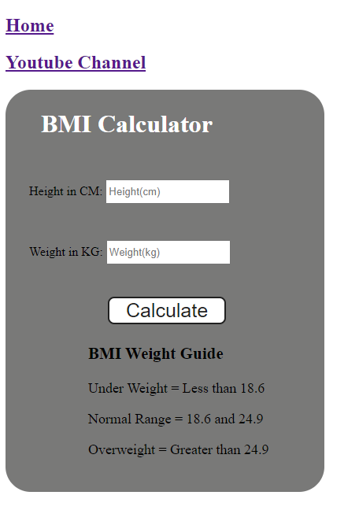

<h1>Body Mass Index (BMI) Calculator</h1>

This project is a simple Body Mass Index (BMI) calculator application built using HTML, CSS, and JavaScript. It allows users to input their height and weight and calculates their BMI instantly.

<h2>Features:</h2>
Calculate BMI based on user input of height and weight.
Display the calculated BMI value.
Provide a basic interpretation of the BMI value.

<h2>Technologies Used:</h2>
HTML
CSS
JavaScript

<h2>How to Use:<h2>
Clone or download the project repository to your local machine.
Open the index.html file in your web browser.

<h2>Screenshots:</h2>

